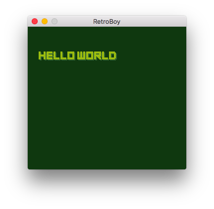

# RetroBoy

RetroBoy is a platform for creating and distributing games, inspired by the aesthetic of the original GameBoy. Games are written in Lua and packaged into "rom" files, which can be run in one of many players.

## Platforms
RetroBoy is designed to be as easy as possible to port between platforms. Current planned platforms are:
- [Windows / OSX / Linux (Love2D)](./love)
- [C++ Native](./native)
- [Web](./web)
- [Android](./android)
- iOS - Not Started
- 3DS - Not Started
